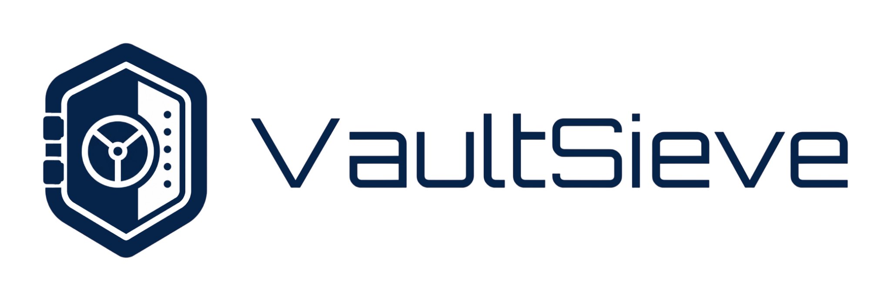
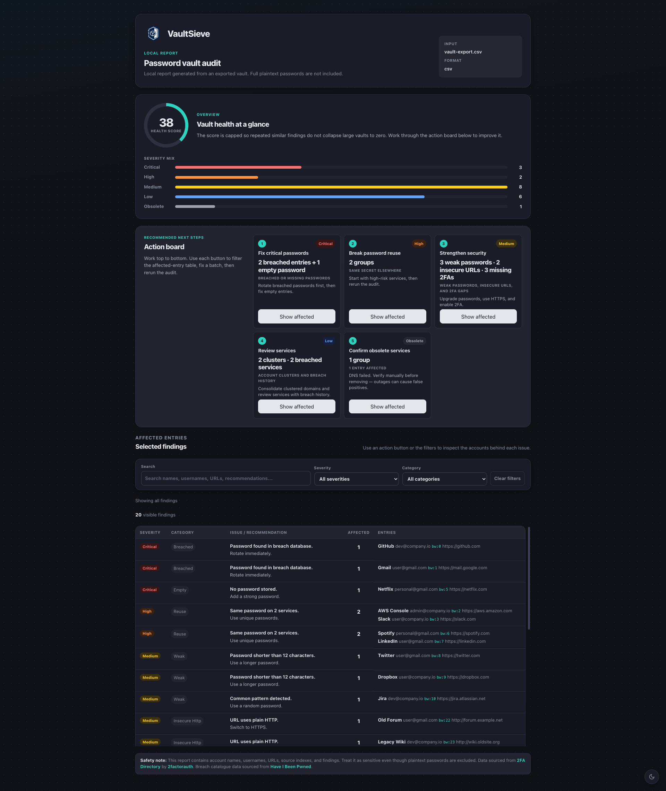
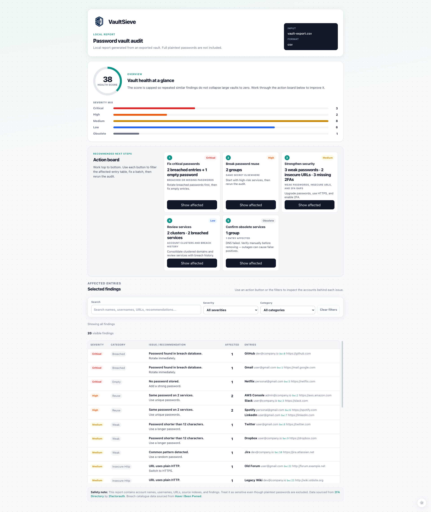

<p align="center">
  
</p>

<p align="center">
  <strong>Audit your exported password vaults. Find duplicates, weak passwords, breached services, missing 2FA, and dead domains — then clean up.</strong>
</p>

<p align="center">
  <a href="https://github.com/AdrianVillamayor/VaultSieve/actions"></a>
  <a href="https://github.com/AdrianVillamayor/VaultSieve/blob/main/LICENSE"></a>
  <a href="https://www.python.org/"></a>
  <a href="https://github.com/AdrianVillamayor/VaultSieve/stargazers"></a>
</p>

<p align="center">
  <a href="#quick-start">Quick Start</a> &middot;
  <a href="#features">Features</a> &middot;
  <a href="#supported-formats">Formats</a> &middot;
  <a href="#html-report">Report Preview</a> &middot;
  <a href="#safety--privacy">Privacy</a>
</p>

---

## HTML Report

<p align="center">
  
  
</p>

## Features

- **Interactive TUI** — arrow-key guided assistant by default, or direct CLI for automation
- **10 analyzers** — duplicates, reused passwords, weak/empty passwords, insecure HTTP, domain concentration, plus optional HIBP password checks, known breached services, 2FA availability, and domain existence
- **4 report formats** — terminal summary, TXT, JSON, and self-contained HTML with health score, severity chart, action board, and filterable findings table
- **Dark and light themes** — HTML report follows system preference, toggleable, persisted
- **Clean output** — generate a deduplicated/cleaned vault export without touching the original
- **Passkey and SSH-key aware** — skips password-specific checks where they don't apply
- **Privacy first** — all checks run locally; optional HIBP uses k-anonymity (only 5-char SHA-1 prefixes sent); no emails or usernames ever leave your machine
- **Persistent config** — set defaults once via TUI or `vaultsieve config`, override per-run with CLI flags

## Supported Formats

| Manager | Formats | Notes |
|---------|---------|-------|
| **Bitwarden** | JSON | Login items (type 1), passkeys, TOTP |
| **LastPass** | CSV | TOTP detection |
| **Dashlane** | CSV, ZIP, JSON | ZIP extracts `credentials.csv`; `.dash` rejected with clear error |
| **1Password** | CSV, 1PUX | Auto-detected by extension |
| **KeePass / KeePassXC** | CSV, XML | Recycle Bin filtered; TOTP from custom fields |
| **Keeper** | CSV, JSON | CSV auto-detects headers vs positional |
| **RoboForm** | CSV | BOM-safe (`utf-8-sig`) |
| **Generic CSV** | CSV | Needs `name`, `url`, `username`, `password` columns — works with Chrome, NordPass, Google Password Manager, Firefox, and others |

Adding new importers is ~20 lines; see [`docs/adding-importers.md`](docs/adding-importers.md).

## Quick Start

**Install with pipx:**

```bash
$ pipx install git+https://github.com/AdrianVillamayor/VaultSieve.git
$ vaultsieve
```

**Or via install script:**

```bash
$ curl -fsSL https://raw.githubusercontent.com/AdrianVillamayor/VaultSieve/main/install.sh | bash
```

**Development install:**

```bash
$ python3 -m venv .venv && .venv/bin/python -m pip install -e '.[dev]'
$ ./vaultsieve
```

See [`docs/install.md`](docs/install.md) for all install methods including Homebrew.

## CLI

Run without arguments to launch the interactive TUI:

```bash
$ vaultsieve
```

Or run audits directly:

```bash
$ vaultsieve audit vault.json --format bitwarden
$ vaultsieve audit passwords.csv --format csv
$ vaultsieve audit export.zip --format dashlane
```

For Dashlane, 1Password, KeePass, and Keeper the file extension (`.csv`, `.json`, `.xml`, `.zip`, `.1pux`) picks the right parser automatically.

### Optional Checks

All optional checks are off by default. Enable them per-run or set defaults with `vaultsieve config`:

```bash
$ vaultsieve audit vault.json --format bitwarden --check-breaches        # HIBP password check
$ vaultsieve audit vault.json --format bitwarden --check-known-breaches  # breached services
$ vaultsieve audit vault.json --format bitwarden --check-2fa             # missing TOTP
$ vaultsieve audit vault.json --format bitwarden --check-domains         # dead domains
```

### Reports and Clean Output

```bash
$ vaultsieve audit vault.json --format bitwarden --report-dir reports
$ vaultsieve audit vault.json --format bitwarden --clean-output clean.json --clean-mode all
```

Clean modes: `duplicates` (default), `obsolete`, `all`.

### Config

```bash
$ vaultsieve config list                          # show all settings
$ vaultsieve config set check_2fa true            # enable by default
$ vaultsieve config set output_formats html,json  # choose report formats
$ vaultsieve config unset report_dir              # reset to default
```

## Safety & Privacy

- Never modifies the original vault file
- Reports never include plaintext passwords
- HIBP password checks use k-anonymity — only 5-char SHA-1 prefixes sent, with padding
- Known breach and 2FA checks download public catalogues and match locally
- Domain checks use DNS only — no credentials sent
- All optional network checks are disabled by default

Full details in [`docs/privacy.md`](docs/privacy.md).

## Tests

```bash
$ python3 -m pytest
```

## Contributing

Pull requests are welcome. For major changes, please open an issue first to discuss what you would like to change.

Please make sure to update tests as appropriate.


## License

[MIT](LICENSE) — Adrián Villamayor
